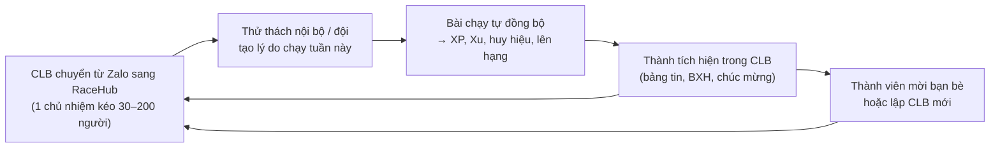

# Định hướng hoàn thiện RaceHub

> Tài liệu này là **chuẩn chung** cho mọi quyết định về sản phẩm, thiết kế và kỹ thuật. Một tính năng chỉ được coi là "xong" khi đạt chuẩn ở §6 và §9.
> Tài liệu liên quan: [benchmark](./architecture/benchmark.md) · [kiến trúc](./architecture/README.md) · [ADR-012 CLB là một không gian riêng](./architecture/adr/012-club-hub.md) · [bảo mật](./BAO_CAO_BAO_MAT.md)

## 1. RaceHub khác các app chạy bộ ở đâu

Strava, Garmin và Nike Run Club **ghi lại** buổi chạy. RaceHub **biến buổi chạy thành trò chơi của cả nhóm**. Mọi quyết định sản phẩm phải củng cố ít nhất một trong ba trụ cột dưới đây. Tính năng không thuộc trụ cột nào thì để sau.

| Trụ cột | Một câu | Đối thủ gần nhất | RaceHub làm khác |
|---|---|---|---|
| **① Game hóa** | Mỗi km là điểm kinh nghiệm, mỗi tuần là một mùa giải nhỏ | Zwift, Duolingo (streak, league), Sweatcoin | Game gắn với **nhóm thật** (CLB, đội), không chỉ cá nhân. Phần thưởng chỉ đến từ **bài chạy hợp lệ**, không mua được thứ hạng |
| **② Thử thách** | Cá nhân và **đồng đội**, tự chấm, tự trao thưởng | UpRace, adidas Running | Có **đội trong thử thách**, CLB đấu CLB, 1-1. Luật minh bạch, BXH realtime, tất toán tự động |
| **③ Quản lý CLB** | CLB là **một app riêng bên trong RaceHub**, thay nhóm Zalo | Strava Clubs, Zalo, Spond, Band | Mọi hoạt động của CLB nằm một chỗ: trò chuyện, thông báo, lịch chạy nhóm, điểm danh, quỹ, thử thách nội bộ, BXH. **Số km thật gắn trực tiếp vào đời sống CLB** (điều Zalo không làm được) |

### Vòng quay tăng trưởng (flywheel)

**Hệ quả chiến lược:** kênh tăng trưởng chính là **chủ nhiệm CLB**, không phải từng runner. Một chủ nhiệm hài lòng mang theo cả nhóm. Vì vậy công cụ quản trị CLB phải **tốt hơn Zalo + Google Sheet + chuyển khoản** mà họ đang dùng.

## 2. Thước đo thành công

| | |
|---|---|
| **North Star** | **Số buổi chạy hợp lệ mỗi tuần được tính vào ít nhất một thử thách hoặc CLB.** Chỉ số này đo cả ba trụ cột: có chạy, có game, có nhóm. |
| **① Game hóa** | % người dùng giữ streak tuần ≥ 4 tuần · % hoàn thành nhiệm vụ tuần · tỷ lệ quay lại D7 / D30 |
| **② Thử thách** | % người dùng tham gia ≥ 1 thử thách mỗi tháng · % thử thách đội đủ quân · % người hoàn thành thử thách |
| **③ CLB** | % người dùng thuộc ≥ 1 CLB · số CLB có ≥ 10 thành viên hoạt động mỗi tuần · tin nhắn và bài đăng / CLB / tuần · % sự kiện có điểm danh |
| **Không được xấu đi** | Tỷ lệ bài bị gắn cờ gian lận · khiếu nại về Xu / quỹ · báo cáo nội dung xấu · crash-free sessions ≥ 99,5% |

## 3. Trụ cột ① — Game hóa: "lớp game" bao trùm mọi màn hình

Game hóa không phải một màn hình. Nó là **lớp phản hồi** xuất hiện ở khắp nơi: sau khi chạy, trong CLB, trong thử thách, ở trang chủ.

### 3.1 Vòng lặp

| Nhịp | Người dùng làm | Nhận được | Đã có |
|---|---|---|---|
| **Mỗi buổi chạy** | Chạy (GPS trong app hoặc đồng bộ Strava) | XP, Xu, tiến độ nhiệm vụ, tiến độ thử thách, có thể lên cấp | ✅ XP / Xu / cấp độ qua sổ cái |
| **Mỗi ngày** | Mở app | Nhiệm vụ ngày (ví dụ "chạy 3 km", "cổ vũ 2 người trong CLB") | ❌ |
| **Mỗi tuần** | Chạy ≥ N buổi | **Streak tuần**. Tính theo tuần, không theo ngày, để không khuyến khích chạy khi chấn thương. Có "khiên bảo vệ streak" mua bằng Xu | ❌ |
| **Mỗi tuần** | Cạnh tranh | **League tuần** kiểu Duolingo: nhóm 30 người cùng trình độ, top lên hạng Đồng → Bạc → Vàng → Bạch kim → Kim cương | ❌ |
| **Mỗi mùa (8 tuần)** | Tích lũy | **Mùa giải** có chủ đề, huy hiệu và vật phẩm giới hạn, BXH CLB theo mùa | ❌ |
| **Cột mốc** | Đạt thành tích | **Huy hiệu** (km đầu tiên, 100 km, PB 5K/10K/HM/FM, streak 10 tuần, chạy nhóm 5 lần) và **danh hiệu** | 🟡 Có bảng `achievements`, `user_badges`, `user_titles`, chưa có luật tự trao |
| **Thể hiện** | Trang bị | Nhân vật và vật phẩm mở theo cấp hoặc đổi bằng Xu | 🟡 CharacterHub, `avatar_items` |

### 3.2 Luật chơi bắt buộc

1. **Chỉ bài chạy hợp lệ mới sinh phần thưởng.** Mọi phần thưởng đi qua `private.reward_activity` và sổ cái (ADR-002, ADR-003).
2. **Không pay-to-win.** Xu nạp (PAID) chỉ mua vật phẩm trang trí và khiên streak, **không** mua XP, thứ hạng hay tiến độ thử thách.
3. **Trần thưởng mỗi ngày** (đã có `maxDailyReward`) và **cấu hình được** trong admin, không sửa code.
4. **Thưởng ngay, thấy ngay.** Màn Tổng kết sau khi chạy hiển thị theo thứ tự: XP → lên cấp (nếu có) → nhiệm vụ hoàn thành → huy hiệu → tiến độ thử thách → thứ hạng CLB thay đổi.

### 3.3 Dữ liệu cần bổ sung

`quests` (định nghĩa nhiệm vụ: chu kỳ, điều kiện, phần thưởng) · `user_quest_progress` · `user_streaks` · `seasons` · `leagues` + `league_members` (theo tuần) · cột `rule` (jsonb) cho `achievements` để server tự trao huy hiệu.

## 4. Trụ cột ② — Thử thách: cá nhân và đồng đội

### 4.1 Các loại thử thách

| Loại | Ai đấu với ai | Cách tính | Ví dụ |
|---|---|---|---|
| **Mục tiêu cá nhân** | Tôi với chính tôi | Đạt ngưỡng (km, số buổi, pace) | "100 km tháng 10" |
| **Cá nhân xếp hạng** | Mọi người tham gia | BXH theo km / số buổi / thời gian | "Ai chạy nhiều nhất tuần" |
| **1-1 (thách đấu)** | Tôi với một bạn | Ai đạt trước hoặc nhiều hơn | "Thách Nam 30 km trong 7 ngày" |
| **Đội trong thử thách** | Các đội do người tham gia lập | Tổng hoặc trung bình của đội, **có trần mỗi người mỗi ngày** để một người khỏe không gánh cả đội | "4 đội × 10 người" |
| **CLB đấu CLB** | Nhiều CLB | Trung bình km / thành viên hoạt động | "Hà Nội Runners vs Sài Gòn Runners" |
| **Nội bộ CLB** | Thành viên một CLB | Như trên, chỉ thành viên thấy và tham gia | "Thử thách tháng của CLB" |

### 4.2 Vòng đời (một luồng cho mọi loại)

`DRAFT → OPEN (đăng ký) → RUNNING → SETTLING → FINISHED` (hoặc `CANCELLED` và hoàn Xu).

- **Tiến độ do server tính** từ bài chạy hợp lệ nằm trong khung thời gian và thỏa luật (`challenge_rules`). Client không bao giờ ghi tiến độ (ADR-003, ADR-004).
- **Tất toán tự động** khi hết hạn: trao huy chương, Xu, XP, huy hiệu. Idempotent theo `challenge_id`.
- **Luật hiển thị trước khi tham gia:** khoảng pace, quãng tối thiểu mỗi bài, nguồn được chấp nhận, phí và phần thưởng.

### 4.3 Dữ liệu cần bổ sung

Hiện **chưa có mô hình đội**: `challenge_participants` không có `team_id`, còn `TeamRosterManager` và `TeamLeaderboard` chưa có dữ liệu thật phía sau. Cần:

`challenge_teams` (id, challenge_id, name, captain_id, club_id, invite_code) · `challenge_participants.team_id` · `challenge_progress_events` (bút toán tiến độ theo từng bài chạy, để thu hồi khi bài bị xóa) · view hoặc bảng BXH cá nhân, đội và CLB · RPC `join_challenge`, `leave_challenge`, `create_team`, `join_team`, `settle_challenge`.

## 5. Trụ cột ③ — CLB là "một app trong app"

Mục tiêu: chủ nhiệm có thể **đóng nhóm Zalo** mà không mất gì. Mở một CLB là vào **không gian riêng** có đầu trang, màu và logo của CLB, với các tab sau.

### 5.1 Các tab của CLB

| Tab | Thay cho | Nội dung | Đã có |
|---|---|---|---|
| **Bảng tin** | Tin nhắn dài trong Zalo | Thông báo ghim từ ban quản trị; bài đăng có ảnh; **bài tự sinh** khi thành viên chạy xong, đạt PB, lên cấp; thích, bình luận, cổ vũ | 🟡 `club_announcements` |
| **Trò chuyện** | Nhóm Zalo | Chat realtime, trả lời, nhắc tên `@`, ảnh, ghim tin, tắt thông báo | ❌ |
| **Lịch** | "Ai đi chạy sáng CN thì thả tim" | Sự kiện chạy nhóm: giờ, điểm hẹn (bản đồ), cự ly, pace nhóm, **RSVP**, nhắc trước 12 giờ, **điểm danh** bằng mã QR hoặc tự nhận từ bài chạy trùng giờ và địa điểm | ❌ |
| **Thử thách** | Google Sheet ghi km | Thử thách nội bộ, chia đội trong CLB, CLB đấu CLB | 🟡 có trường `target_club_id` |
| **BXH** | Ảnh chụp màn hình Strava | BXH tuần, tháng, mùa (km, số buổi, số lần đi chạy nhóm) | ❌ |
| **Thành viên** | Danh sách Zalo | Vai trò (chủ nhiệm, phó, thủ quỹ, điều phối), duyệt đơn gia nhập, hồ sơ và thống kê từng người, chuyên cần | ✅ vai trò và quyền (`roles`, `permissions`) |
| **Quỹ** | Sổ tay thủ quỹ + chuyển khoản | Thu phí tháng (ai đã đóng, ai chưa, nhắc tự động), khoản chi có ảnh hóa đơn, số dư **minh bạch theo sổ cái**, xuất báo cáo | 🟡 quỹ theo sổ cái, chưa có thu phí và khoản chi |
| **Khác** | Bình chọn Zalo, album | Bình chọn (chọn áo, chọn giải), album ảnh sự kiện, giải thưởng nội bộ | ❌ |

### 5.2 Nguyên tắc cho CLB

1. **Mọi thứ có phạm vi CLB.** RLS theo `club_members` (thành viên đang hoạt động). Người ngoài chỉ thấy trang giới thiệu nếu CLB công khai.
2. **Quyền chi tiết** theo `has_permission(club_id, code)`: đăng thông báo, duyệt thành viên, quản lý quỹ, tạo sự kiện, kiểm duyệt chat.
3. **Tiền thật không đi qua RaceHub** ở giai đoạn này. Phí CLB ghi nhận là "đã đóng" (thủ quỹ xác nhận hoặc đối soát VietQR). Chỉ Xu đi qua sổ cái (ADR-011).
4. **Thông báo có kiểm soát.** Mỗi CLB có mức thông báo: tất cả, chỉ nhắc tên và thông báo, hoặc tắt. Không spam như Zalo.
5. **Kiểm duyệt:** báo cáo tin nhắn, ẩn tin, cấm chat có thời hạn, nhật ký quản trị (`admin_audit_log`).

### 5.3 Dữ liệu cần bổ sung

`club_posts` + `club_post_reactions` + `club_post_comments` · `club_messages` (chat, có `reply_to`, `deleted_at`) + `club_message_reads` · `club_events` + `club_event_rsvps` (có `checked_in_at`) · `club_polls` + `club_poll_votes` · `club_dues` (kỳ thu, số tiền, trạng thái từng thành viên) + `club_expenses` · `notifications` + `notification_settings` (theo CLB) · `club_join_requests`. Chi tiết và lý do nằm ở [ADR-012](./architecture/adr/012-club-hub.md).

## 6. Năm nguyên tắc trải nghiệm

1. **Không thao tác thì vẫn có dữ liệu.** Bài chạy từ đồng hồ tự về, bảng tin CLB tự sinh, thử thách và nhiệm vụ tự cập nhật.
2. **Mỗi km đều được thấy ngay:** XP, nhiệm vụ, thử thách và BXH CLB thay đổi trong vài giây sau khi đồng bộ.
3. **Minh bạch.** Bài chờ duyệt luôn có lý do; mọi Xu và mọi đồng quỹ CLB có lịch sử; luật thử thách hiện trước khi tham gia.
4. **Người mới phải thắng sớm.** Trong tuần đầu có huy hiệu km đầu tiên, nhiệm vụ dễ và lời chào tự động từ CLB.
5. **Nhóm trước, cá nhân sau.** CLB và đội giữ chân người dùng lâu hơn BXH toàn cầu.

## 7. Điều hướng và màn hình

**Thanh điều hướng dưới giữ 5 tab:** Trang chủ · Thử thách · **Chạy** (nút giữa) · CLB · Tôi.

- **Trang chủ = trung tâm game:** streak tuần, nhiệm vụ hôm nay, league tuần, thử thách đang chạy, hoạt động mới từ các CLB của tôi.
- **CLB:** nếu chỉ thuộc một CLB thì vào thẳng không gian CLB đó. Nếu thuộc nhiều CLB thì hiện danh sách kiểu hộp thư Zalo: số tin chưa đọc và sự kiện sắp tới của từng CLB.
- **Thử thách:** Của tôi / Khám phá / Đã xong, có lọc theo Cá nhân · Đội · CLB.

### Hiện trạng màn hình

✅ đạt chuẩn · 🟡 chạy được nhưng giao diện cũ · ❌ chưa có. Mã MH theo tài liệu 28 màn hình; mã **CLB-x** là màn hình mới cho trụ cột ③.

| Trụ cột | Màn hình | Trạng thái | Sprint |
|---|---|---|---|
| ③ CLB | **CLB-1** Không gian CLB (đầu trang + tab) · **CLB-2** Bảng tin + thông báo ghim · **CLB-3** Trò chuyện | 🟡 · 🟡 · ❌ | **2** |
| | MH22 Quản lý CLB / **CLB-4** Thành viên và vai trò · **CLB-5** BXH CLB | 🟡 · ❌ | **2** |
| | **CLB-6** Lịch và sự kiện · **CLB-7** Điểm danh · MH21 / **CLB-8** Quỹ và thu phí · **CLB-9** Bình chọn | ❌ · ❌ · 🟡 · ❌ | 5 |
| ② Thử thách | MH10 Danh sách | ✅ | — |
| | MH11 Chi tiết · MH12 BXH (cá nhân, đội) · MH13 Tạo thử thách 4 bước · **TT-1** Đội: lập, mời, đổi đội | ❌ · ❌ · 🟡 · 🟡 | **3** |
| | MH14 Xác nhận cược / 1-1 có cược | ❌ | Sau tư vấn pháp lý (ADR-011) |
| ① Game | MH5 Trang chủ = trung tâm game (streak, nhiệm vụ, league) | 🟡 | **4** |
| | MH17 Tổng kết sau chạy có chuỗi phần thưởng · MH9 BXH / league tuần | ✅ cơ bản · ❌ | **4** |
| | Huy hiệu, danh hiệu · MH25 Ví Xu · MH26 Tủ đồ · MH19 Cửa hàng | 🟡 · ❌ · 🟡 · ❌ | 4 |
| Nền | MH15–16 Chạy, xác thực · MH24 Hồ sơ · MH28 Cài đặt · MH2 Kết nối | ✅ | — |
| | MH1 Đăng nhập · MH3–4 Onboarding (chọn CLB ngay bước 2) | 🟡 · ❌ | 5 |
| | MH6 Chi tiết bài chạy · MH7 Thông báo · MH18 Poster chia sẻ | ❌ | 4 · 2 · 5 |
| Để sau | MH20 BIB · MH23 HLV | ❌ | 7 |

## 8. Lộ trình theo trụ cột

Mỗi sprint kéo dài 2 tuần và kết thúc bằng một bản **deploy lên production**, có checklist kiểm tra.

**Vì sao làm CLB trước:** CLB là kênh tăng trưởng (một chủ nhiệm kéo cả nhóm), là nơi thử thách đội và game hóa **được nhìn thấy**, và là phần người dùng hiện phải dùng Zalo để bù. Thử thách đội cần có CLB và thông báo trước. Game hóa cần có thử thách và CLB để có thứ mà thưởng.

| Sprint | Trụ cột | Mục tiêu (chỉ số) | Nội dung |
|---|---|---|---|
| **0–1 ✅** | Nền | Nền móng an toàn | Vá bảo mật, sổ cái, đồng bộ Strava, khung giao diện mới, màn Chạy / Thử thách / Hồ sơ |
| **2** | ③ | % người dùng thuộc CLB, tin nhắn / CLB / tuần | **Không gian CLB** (đầu trang, tab), **bảng tin** (thông báo ghim, bài đăng, bài tự sinh từ buổi chạy, cổ vũ), **trò chuyện realtime**, **thành viên** (duyệt đơn, vai trò), **BXH CLB tuần**, **thông báo trong app** (chuông) |
| **3** | ② | % người tham gia thử thách, % đội đủ quân | **Engine tiến độ phía server**, chi tiết thử thách, tham gia / rời, **đội** (lập, mời bằng mã, đội trưởng), **BXH realtime** cá nhân / đội / CLB, **thử thách nội bộ CLB**, tất toán + huy chương, wizard 4 bước |
| **4** | ① | Streak ≥ 4 tuần, D30 | **Trang chủ = trung tâm game**, **nhiệm vụ ngày / tuần**, **streak tuần** + khiên, **huy hiệu tự trao**, **league tuần**, Tổng kết sau chạy có chuỗi phần thưởng, ví Xu, chi tiết bài chạy (bản đồ, splits, PB) |
| **5** | ③ + nền | % sự kiện có điểm danh, kết nối Strava trong 24 giờ | **Lịch chạy nhóm** + RSVP + nhắc + **điểm danh**, **quỹ và thu phí** thành viên (VietQR, nhắc đóng phí), khoản chi, bình chọn, album; **PWA + Web Push**; onboarding 3 bước (đăng nhập → kết nối Strava → chọn CLB) |
| **6** | ① + ② | Buổi chạy / tuần | **Mùa giải 8 tuần** (chủ đề, vật phẩm giới hạn), cửa hàng và tủ đồ, **CLB đấu CLB**, **app Expo** cho màn Chạy (GPS nền, giọng HLV) |
| **7** | Doanh thu | Doanh thu | Gói **CLB Pro** (nhiều quản trị, xuất báo cáo, tên miền mời riêng), dashboard ban tổ chức giải ảo, thanh toán, marketplace voucher |

## 9. Chuẩn "đẹp và sắc nét" (bắt buộc cho mọi màn hình)

| Hạng mục | Chuẩn | Kiểm tra |
|---|---|---|
| **Chữ** | Be Vietnam Pro; số liệu dùng JetBrains Mono + `tabular`; **cỡ tối thiểu 12px**; tiêu đề màn hình 24px bold | Không có `text-[9px]`, `text-[10px]` |
| **Icon** | Chỉ dùng `lucide-react`, nét đồng nhất. **Không dùng emoji làm icon giao diện** (emoji chỉ xuất hiện trong nội dung người dùng) | Tìm emoji trong `features/**/components` |
| **Màu** | Chỉ dùng token (`bg-surface`, `text-brand`, `text-coin`, `text-xp`…). Xanh neon = hành động chính; cam = Xu; xanh tím = XP; đỏ = nguy hiểm. **Màu CLB** chỉ dùng cho đầu trang CLB, không thay màu hành động | Không có mã màu cứng, không `slate-*` / `orange-*` |
| **Khoảng cách** | Bội số của 4px; lề màn hình 16px; khoảng cách giữa các khối 16–24px | |
| **Vùng chạm** | ≥ 44×44px; hành động phá hủy (dừng chạy, xóa, trừ Xu, rời CLB, xóa thành viên) phải **giữ** hoặc **xác nhận** | |
| **Trạng thái** | Mỗi màn hình có đủ 4 trạng thái: *đang tải* (skeleton), *trống* (hướng dẫn + nút hành động), *lỗi* (nút thử lại), *có dữ liệu* | |
| **Phản hồi** | Toast cho kết quả thao tác; không dùng `alert()`; nút có trạng thái `loading`; phần thưởng có hiệu ứng ngắn (≤ 1,2 giây, bỏ qua được) | Không có `alert(` |
| **Ngôn ngữ** | Tiếng Việt tự nhiên, ngắn gọn, xưng "bạn"; **không hiện mã lỗi thô** (dùng `shared/lib/errors.ts`) | |
| **Chuyển động** | 150–250ms, ease-out; tôn trọng `prefers-reduced-motion` | |
| **Truy cập** | Tương phản ≥ 4.5:1; có `aria-label` cho nút chỉ có icon; điều khiển được bằng bàn phím | |

## 10. "Định nghĩa hoàn thành" cho mỗi tính năng

- [ ] Ghi rõ tính năng phục vụ trụ cột nào và làm tăng chỉ số nào ở §2
- [ ] Đạt 100% chuẩn ở §9; chụp màn hình ở 390px (mobile) và 1280px (desktop)
- [ ] Mọi thay đổi DB là migration, có test trong `tests/db/` (quyền truy cập theo vai trò CLB + nghiệp vụ)
- [ ] Logic thuần có unit test; lint, typecheck, test, build đều xanh trên CI
- [ ] Không có đường ghi tài sản (Xu, XP, tiến độ, quỹ) từ client (ADR-003)
- [ ] Có sự kiện analytics cho các bước chính của tính năng
- [ ] Hướng dẫn triển khai được cập nhật nếu cần biến môi trường hoặc migration mới

## 11. Việc cần làm ngay về hạ tầng

1. **Merge nhánh hiện tại vào `main` và deploy lên Vercel** với domain chính thức. Webhook Strava và link mời CLB cần địa chỉ công khai; Codespaces chỉ phù hợp để phát triển.
2. **Tạo 2 project Supabase:** *staging* (thử migration) và *production*. Không chạy thử migration trực tiếp trên production nữa.
3. **Gắn Sentry** (theo dõi lỗi) và **PostHog** (đo các chỉ số ở §2) trước khi có người dùng thật.
4. **Tạo lại Strava Client Secret** (đã bị lộ trong ảnh chụp màn hình).
5. **Bật Supabase Realtime** cho các bảng CLB theo ADR-010 và ADR-012 trước Sprint 2.
