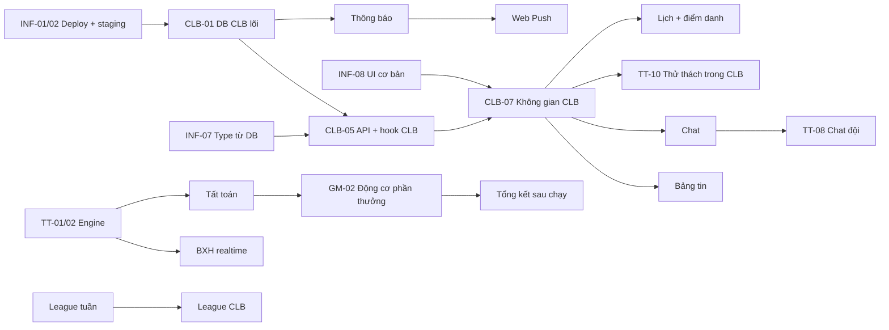

# Kế hoạch hoàn thiện RaceHub

> **Vai trò:** tài liệu quản lý dự án. Trả lời bốn câu hỏi: làm gì, theo thứ tự nào, thế nào là xong, và làm sao biết mình đang đúng hướng.
> **Nguồn:** [Định hướng sản phẩm](./DINH_HUONG_SAN_PHAM.md) (ba trụ cột) · [Cấu trúc thư mục](./CAU_TRUC_THU_MUC.md) · [ADR](./architecture/adr/README.md) · tài liệu 28 màn hình.
> **Cập nhật:** 23/09/2026. Mỗi cuối sprint, cập nhật cột *Trạng thái* ở §4 và ghi kết quả vào §9.

## 0. Cách dùng tài liệu

- Mỗi việc có **mã** (`CLB-05`, `TT-03`…). Dùng mã này trong tên nhánh (`feat/CLB-05-club-chat`), commit và PR để truy vết.
- Ký hiệu loại việc: **DB** migration, RPC, policy · **API** `features/*/api` và hook · **UI** màn hình, component · **QA** test, kiểm thử tay · **OPS** hạ tầng.
- Trạng thái: ⬜ chưa làm · 🔄 đang làm · ✅ xong (đạt [Định nghĩa hoàn thành](./DINH_HUONG_SAN_PHAM.md#10-định-nghĩa-hoàn-thành-cho-mỗi-tính-năng)) · ⏸ tạm hoãn.
- **Cách phối hợp:**
  1. Claude làm từng việc trên nhánh, kèm test, rồi push.
  2. Bạn kiểm tra trên *staging* theo mục **Nghiệm thu** của việc đó.
  3. Đạt thì merge vào `main`; production tự deploy.

## 1. Mốc phát hành

| Mốc | Sprint | Ngày (dự kiến) | Ai dùng được | Điều kiện đạt mốc |
|---|---|---|---|---|
| **M0 Nền sạch** | 1.5 | 02/10 | Nội bộ | Có production + staging, Sentry, PostHog, CI đầy đủ, secret đã xoay |
| **M1 CLB thay Zalo** | 2 | 16/10 | **1 CLB thí điểm** | CLB chat, đăng thông báo, thấy BXH tuần. Chủ nhiệm đồng ý dùng song song Zalo |
| **M2 Thử thách đội** | 3 | 30/10 | 3 CLB thí điểm | Chạy trọn một thử thách đội: tạo, chia đội, BXH realtime, tất toán |
| **M3 Beta kín** | 4 | 13/11 | ~300 người, 5 CLB | Vòng game đầy đủ; D7 ≥ 35%; crash-free ≥ 99,5% |
| **M4 Ra mắt công khai** | 5 | 27/11 | Mọi người | Cài được lên màn hình chính (PWA), có thông báo đẩy, onboarding, lịch và quỹ CLB. **Chủ nhiệm thí điểm tắt nhóm Zalo** |
| **M5 Mùa giải 1** | 6 | 11/12 | | Mùa giải 8 tuần đầu tiên, league CLB, cửa hàng vật phẩm |
| **M6 Doanh thu** | 7 | 25/12 | | Gói CLB Pro, dashboard ban tổ chức |

> Ngày tính theo sprint 2 tuần, bắt đầu từ thứ Hai 05/10 sau tuần hạ tầng. Nếu một mốc trễ, **cắt phạm vi** (chuyển việc 🟡 sang sprint sau), không lùi mốc.

## 2. Hướng thiết kế: "đẹp nhất"

### 2.1 Nhận diện: *Night Track*

Tinh thần: **đường chạy lúc 5 giờ sáng**. Nền tối sâu, một màu neon duy nhất cho hành động, số liệu lớn và sắc như đồng hồ thể thao. Mỗi màn hình chỉ có **một** điểm nhấn neon.

| Yếu tố | Quy định |
|---|---|
| **Màu** | Giữ token hiện có: nền `#0a0d12`, bề mặt `#121720`, **Action Green `#b6ff3b`** chỉ cho hành động chính và tiến độ của tôi, **Xu `#ffb020`**, **XP `#7c9cff`**, **Live `#ff3b5c`**, độ hiếm vật phẩm theo 4 màu. Thêm token **`--club-accent`**: màu riêng của từng CLB, chỉ dùng ở đầu trang CLB và viền avatar |
| **Chữ** | Thang cỡ 12 · 14 · 16 · 20 · 24 · 32 · 48. **Số liệu lớn** (km, pace, thứ hạng) dùng JetBrains Mono 32–48px, `tabular-nums` |
| **Hình khối** | Bo góc 16px cho thẻ, 12px cho nút, 999px cho chip. Viền mảnh 1px `--color-border`, không đổ bóng nặng |
| **Chuyển động** | Số đếm tăng khi phần thưởng về; vòng tiến độ chạy đầy; hạng mới trượt lên. 150–250ms, không lặp vô hạn trừ trạng thái *Live* |
| **Minh họa** | Icon lucide nét 1.75. Trạng thái trống có hình minh họa đường nét cùng phong cách, không dùng ảnh stock |

### 2.2 Component đặc trưng (làm một lần, dùng khắp nơi)

| Component | Dùng ở | Mô tả |
|---|---|---|
| `ProgressRing` | Trang chủ, chi tiết thử thách, nhiệm vụ | Vòng tiến độ kiểu Apple Watch; nhiều vòng lồng nhau (tuần, thử thách, nhiệm vụ) |
| `RewardCascade` | Tổng kết sau khi chạy | Chuỗi thẻ lần lượt hiện ra: XP → lên cấp → nhiệm vụ → huy hiệu → thử thách → hạng CLB |
| `RankRow` | Mọi BXH | Hạng, avatar, tên, giá trị (mono), mũi tên ↑↓ so với hôm qua; dòng của tôi luôn được ghim |
| `ClubHeader` | Không gian CLB | Ảnh bìa + logo + màu CLB, số thành viên, nút mời, thanh tab dính khi cuộn |
| `RunCard` | Bảng tin, chat, chia sẻ | Thẻ bài chạy: bản đồ thu nhỏ, km, pace, thời gian, huy hiệu mới |
| `TeamVersus` | Thử thách đội | Hai (hoặc nhiều) cột đội đối đầu, thanh tiến độ, avatar xếp chồng |
| `Countdown` | Thử thách, sự kiện | Đếm ngược tới lúc bắt đầu / kết thúc |
| `Sheet`, `Dialog`, `Tabs`, `Avatar`, `AvatarStack`, `Input`, `Composer`, `Chip` | Mọi nơi | Bộ cơ bản còn thiếu trong `shared/ui` |

Mọi component đặc trưng được bày ở trang **`/dev/ui`** (chỉ bật ở môi trường dev) để xem và chụp màn hình. Đây là "sách mẫu" thay cho Storybook.

## 3. Hướng sản phẩm: "khác biệt nhất"

Bảy tính năng **chỉ RaceHub có**. Đây là thứ để quảng bá, nên phải làm thật tốt:

| # | Tính năng đặc trưng | Trụ cột | Sprint |
|---|---|---|---|
| 1 | **"Không bỏ ai lại phía sau".** Chế độ đội *Chốt đoàn* (xếp hạng theo người yếu nhất đội) và *Gap nội bộ* (thưởng đội có chênh lệch nhỏ). Đội mạnh phải kéo người yếu cùng chạy | ② | 3 |
| 2 | **Km thật sống trong CLB.** Chạy xong, bảng tin CLB tự có bài; chat có thẻ bài chạy; thứ Hai tự đăng **Tổng kết tuần** của CLB | ③ | 2 |
| 3 | **Tự điểm danh chạy nhóm.** Bài chạy trùng giờ và gần điểm hẹn thì tự được điểm danh, không cần "thả tim" | ③ | 5 |
| 4 | **Quỹ minh bạch.** Ai đã đóng, ai chưa, chi gì, còn bao nhiêu; ai cũng xem được, thủ quỹ không phải trả lời từng người | ③ | 5 |
| 5 | **League CLB.** Các CLB xếp hạng theo **km trung bình trên mỗi thành viên hoạt động** (CLB nhỏ vẫn thắng được CLB lớn), lên xuống hạng theo mùa | ① ③ | 6 |
| 6 | **Streak tuần có khiên.** Streak tính theo tuần để không khuyến khích chạy khi chấn thương; khiên bảo vệ đổi bằng Xu | ① | 4 |
| 7 | **Cổ vũ có giá trị.** Tặng Xu kèm lời cổ vũ (có trần), người nhận thấy ngay trong thông báo | ① ③ | 4 |

## 4. Kế hoạch chi tiết theo sprint

### Sprint 1.5: Hạ tầng (23/09 → 02/10) · Mốc M0

| Mã | Việc | Loại | Nghiệm thu |
|---|---|---|---|
| INF-01 | Merge nhánh hiện tại vào `main`; tạo project Vercel, gắn domain chính thức | OPS | Mở domain thấy trang đăng nhập; mỗi lần merge `main` tự deploy |
| INF-02 | Tạo Supabase **staging**; chạy migration 000100–000400; Vercel Preview trỏ vào staging | OPS | Bản preview của mỗi PR dùng DB staging, không đụng production |
| INF-03 | **Xoay Strava Client Secret**; đăng ký webhook Strava với domain thật | OPS | Chạy trên đồng hồ → bài tự vào RaceHub trong ≤ 1 phút |
| INF-04 | Xác nhận migration 000400 đã chạy trên production (`select proname from pg_proc where proname = 'ingest_provider_activity'`) | OPS | Trả về 1 dòng |
| INF-05 | Gắn **Sentry** (client + server) | OPS | Lỗi thử xuất hiện trên Sentry kèm route |
| INF-06 | Gắn **PostHog**; định nghĩa bộ sự kiện: `run_saved`, `activity_synced`, `club_joined`, `club_message_sent`, `challenge_joined`, `reward_shown`… | OPS | Dashboard North Star có số liệu |
| INF-07 | Sinh type từ DB: `supabase gen types` → `shared/types/database.ts`; client Supabase có type | API | `supabase.from('clubs')` có gợi ý cột; lệnh sinh type chạy trong CI |
| 🔄 INF-08 | Bộ component cơ bản còn thiếu: `Tabs`, `Sheet`, `Dialog/Confirm`, `Input`, `Avatar`, `AvatarStack`, `Chip`; trang `/dev/ui` | UI | Mọi component có đủ 4 trạng thái trên `/dev/ui`, chụp ở 390px |
| ✅ INF-09 | Chuyển chạy định kỳ sang **Vercel Cron** → `/api/cron/*` (bảo vệ bằng `CRON_SECRET`), vì production chưa bật `pg_cron` | OPS | Route cron từ chối request không có secret |

### Sprint 2: CLB lõi (05/10 → 16/10) · Trụ cột ③ · Mốc M1

> **Trạng thái:** code đã xong trên nhánh, chờ chạy migration 000500 và thử với CLB thí điểm (QA-2). Chưa làm: chia sẻ bài chạy vào chat (chuyển sang CLB-09b, Sprint 3), "đang gõ…" (để sau vì cần Realtime Authorization).

**Mục tiêu:** một CLB thật dùng RaceHub để nói chuyện và theo dõi nhau chạy thay cho Zalo.

| Mã | Việc | Loại | Nghiệm thu |
|---|---|---|---|
| ✅ CLB-01 | Migration `000500_club_hub_core`: • `private.is_club_member()` • `club_posts` (kind: POST · ANNOUNCEMENT · AUTO_RUN · AUTO_PB · AUTO_LEVEL · RECAP), `club_post_reactions`, `club_post_comments` • `club_messages`, `club_message_reads` • `club_join_requests`, `notifications`, `notification_settings` • chuyển `club_announcements` sang `club_posts` • thêm các bảng vào publication realtime | DB | Chạy 2 lần không lỗi; test RLS: người ngoài không đọc được, thành viên đọc được, chỉ người có quyền `ANNOUNCE` đăng được thông báo |
| ✅ CLB-02 | RPC `create_club_post`, `react_club_post`, `comment_club_post`, `pin_club_post`, `hide_club_content`, `request_join_club`, `review_join_request`, `mark_club_read`, `set_notification_level` | DB | Mỗi RPC có test quyền + nghiệp vụ trong `tests/db/club-hub.test.ts` |
| ✅ CLB-03 | Chat: `insert` trực tiếp qua RLS, giới hạn 20 tin/phút bằng trigger, xóa mềm, `reply_to` | DB | Tin thứ 21 trong 1 phút bị từ chối kèm mã lỗi thân thiện |
| ✅ CLB-04 | Trigger bài tự sinh: bài chạy **APPROVED** → một `AUTO_RUN` trong mỗi CLB của người đó (tôn trọng cài đặt riêng tư) | DB | Đồng bộ một bài Strava → bài đăng xuất hiện trong CLB ≤ 5 giây |
| ✅ CLB-05 | `features/club/api/{postsApi,chatApi,membersApi}.ts`; hook `useClubFeed` (cuộn vô hạn), `useClubChat` (realtime + gửi lạc quan), `useUnread` | API | Hai trình duyệt chat với nhau: tin đến < 1 giây; mất mạng rồi có lại không mất tin |
| ✅ CLB-06 | Route `/clubs` dạng **hộp thư CLB**: tin chưa đọc, hoạt động mới; thuộc đúng 1 CLB thì vào thẳng CLB đó | UI | Đủ 4 trạng thái; có nút tạo CLB / nhập mã mời |
| ✅ CLB-07 | `/clubs/[id]/layout.tsx`: `ClubHeader` + `ClubTabs` (Bảng tin · Trò chuyện · Thử thách · BXH · Thành viên · Cài đặt) | UI | Tab dính khi cuộn; đổi tab không tải lại đầu trang; đúng màu CLB |
| ✅ CLB-08 | Tab **Bảng tin**: thông báo ghim, `PostCard` theo từng loại, `RunCard`, thả cảm xúc, bình luận, soạn bài có ảnh (Storage `club-media`) | UI | Đăng bài có ảnh ≤ 3 giây; thông báo ghim luôn ở đầu |
| ✅ CLB-09 | Tab **Trò chuyện**: `ChatThread`, bong bóng tin, trả lời, nhắc `@tên`, chia sẻ bài chạy, "đang gõ…" (Broadcast) | UI | Cuộn mượt 1.000 tin; nhắc tên tạo thông báo cho người được nhắc |
| ✅ CLB-10 | Tab **Thành viên**: danh sách, vai trò, duyệt đơn gia nhập, mời bằng link / QR; làm lại `ClubMembersManager` và `ClubSettings` theo chuẩn mới | UI | Chủ nhiệm duyệt đơn bằng một chạm; xóa thành viên phải xác nhận |
| ✅ CLB-11 | Tab **BXH**: tuần / tháng theo km, số buổi (view `club_leaderboard_week`) | DB·UI | Dòng của tôi được ghim; số khớp với tổng bài chạy APPROVED |
| ✅ CLB-12 | **Chuông thông báo** trên TopBar + `/notifications`; cài đặt mức thông báo theo CLB | UI | Số chưa đọc cập nhật realtime; mức NONE thì không nhận gì từ CLB đó |
| ✅ CLB-13 | Cron thứ Hai 07:00: bài **Tổng kết tuần** của mỗi CLB (tổng km, top 3, người mới) | DB·OPS | Chạy lại cron không tạo bài trùng |
| ✅ CLB-14 | Xóa `ClubsScreen` cũ (714 dòng), `ClubActivities`, `MyClubsRail` sau khi màn mới thay thế | UI | Không còn file cũ; ESLint không cảnh báo `any` trong `features/club` |
| QA-2 | Kiểm thử cùng CLB thí điểm: 20+ người dùng thật trong 3 ngày | QA | Ghi nhận ≥ 10 góp ý; sửa lỗi chặn trước khi đóng sprint |

### Sprint 3: Engine thử thách + đội (19/10 → 30/10) · Trụ cột ② · Mốc M2

> **Trạng thái:** code xong (TT-01 → TT-11), 12 test DB + 8 test logic. Làm theo phạm vi: mục tiêu cá nhân, xếp hạng, 1-1 (không cược), đồng đội 4 chế độ, cộng đồng, nội bộ CLB (thưởng trích quỹ). **Để sau:** cược giữa người chơi (chờ pháp lý — ADR-011), tiếp sức, săn mồi, bí mật, Pace Breaker, Negative Split (cần phân tích từng km — TT-12…TT-16). Chat riêng của đội (TT-08 phần chat) chuyển sang Sprint 5 cùng Web Push.

| Mã | Việc | Loại | Nghiệm thu |
|---|---|---|---|
| ✅ TT-01 | Migration `000600_challenge_engine`: • `challenge_teams` (captain, club_id, invite_code, màu) • `challenge_participants.team_id` • `challenge_progress_events` (một dòng cho mỗi bài chạy tính vào thử thách) • trạng thái vòng đời `DRAFT → OPEN → RUNNING → SETTLING → FINISHED / CANCELLED` | DB | Test: bài chạy ngoài khung giờ, sai pace, dưới quãng tối thiểu **không** được tính |
| ✅ TT-02 | `private.apply_activity_to_challenges(activity_id)` được gọi từ luồng thưởng; thu hồi khi bài bị xóa | DB | Xóa bài trên Strava → tiến độ thử thách giảm tương ứng |
| ✅ TT-03 | `model/scoring.ts` + SQL tương ứng cho 8 chế độ: `ACCUMULATE`, `DISTANCE_TARGET`, `MILESTONE`, `STREAK`, `TEAM_SUM`, `TEAM_AVG`, `TEAM_GAP`, `LAST_MEMBER`; **trần km mỗi người mỗi ngày** trong thử thách đội | DB·API | Bảng test cùng dữ liệu cho kết quả giống nhau ở TypeScript và SQL |
| ✅ TT-04 | RPC `join_challenge`, `leave_challenge`, `create_team`, `join_team_by_code`, `kick_from_team`, `cancel_challenge` (hoàn Xu qua sổ cái) | DB | Idempotent; rời thử thách sau khi bắt đầu không được hoàn phí |
| ✅ TT-05 | Tất toán `settle_challenge` (cron mỗi 15 phút): huy chương, Xu, XP, huy hiệu | DB·OPS | Chạy 2 lần không trao 2 lần; đúng thứ tự khi bằng điểm |
| ✅ TT-06 | `/challenges/[id]`: hero (ảnh, `Countdown`), luật rõ ràng, `ProgressRing` của tôi, nút Tham gia / Rời (giữ để rời) | UI | Người chưa đăng nhập xem được luật; nút tham gia hiện phí và số Xu còn lại |
| ✅ TT-07 | BXH realtime: cá nhân · đội (`TeamVersus`) · CLB; ghim dòng của tôi / đội tôi | UI | Bạn chạy xong → hạng đổi trên máy người khác ≤ 5 giây |
| ✅ TT-08 | Màn **đội**: lập đội, mời bằng mã / link, đội trưởng xếp người, chat đội (dùng lại chat CLB với `scope = team`) | UI | Đội đủ người thì khóa danh sách lúc thử thách bắt đầu |
| ✅ TT-09 | **Wizard 4 bước** `/challenges/new`: ① Loại (cá nhân / đội / CLB) → ② Luật (chế độ, km, pace, quãng tối thiểu) → ③ Thời gian và phần thưởng (phí tính trước bằng RPC) → ④ Xem lại | UI | Không tạo được thử thách sai luật; xem trước giống hệt trang chi tiết |
| ✅ TT-10 | Tab **Thử thách** trong CLB: thử thách nội bộ, chia đội tự động theo pace | UI | Chủ nhiệm tạo thử thách tháng cho CLB trong ≤ 1 phút |
| ✅ TT-11 | Màn **kết quả**: bục vinh quang, huy chương, chia sẻ | UI | Có trạng thái "đang tổng kết" trong lúc SETTLING |
| ✅ KT-01 | **Kinh tế Xu (ADR-014):** biểu phí theo số người, thử thách CLB trả bằng quỹ, vé tạo miễn phí, thưởng chạy km đầu + km tiếp, trần ngày | DB | 8 test DB `economy-admin` |
| ✅ KT-02 | **Bảng điều phối admin** `/admin`: Tổng quan dòng Xu, Cộng/Trừ Xu (cá nhân + quỹ CLB), Vé miễn phí, Chính sách có mô phỏng, Duyệt bài | UI | Mọi thao tác có lý do + nhật ký, không cho âm số dư |
| ✅ KT-03 | Wizard báo giá bằng `quote_challenge`: ai trả (ví/quỹ), dùng vé, gợi ý khi thiếu Xu | UI | Không bấm được "Tạo" khi không đủ Xu |
| QA-3 | Chạy thật một thử thách đội 7 ngày với 3 CLB thí điểm | QA | Không có khiếu nại sai điểm |

### Sprint 4: Lớp game (02/11 → 13/11) · Trụ cột ① · Mốc M3 Beta kín

> **Trạng thái:** code xong GM-01 → GM-09, GM-11 (migration 000800, ADR-015, 8 test DB + 3 test logic). **Còn:** GM-10 chi tiết bài chạy có bản đồ; admin sửa nhiệm vụ/huy hiệu trên giao diện (hiện sửa trong bảng `quests`, `achievements`).

| Mã | Việc | Loại | Nghiệm thu |
|---|---|---|---|
| ✅ GM-01 | Migration `000800_game_layer`: `quests`, `user_quest_progress`, `user_streaks`, cột `achievements.rule` (jsonb), `league_groups`, `league_members`, `cheers`, `game_events` | DB | Test mỗi luật: nhiệm vụ, streak, huy hiệu |
| ✅ GM-02 | Động cơ phần thưởng: sau mỗi bài APPROVED → nhiệm vụ → streak → huy hiệu → league; tất cả qua sổ cái, có trần | DB | Một bài chạy trả về **danh sách phần thưởng** (dùng cho `RewardCascade`) |
| ✅ GM-03 | Bộ huy hiệu đầu tiên (27): km đầu tiên, 10/50/100/500/1000 km, 5K/10K/HM/FM, streak 4/10/26 tuần, chim sớm/cú đêm, thử thách (đội, vô địch), cổ vũ, CLB, cấp độ. *Chạy nhóm 5 lần: chờ sự kiện CLB (Sprint 5)* | DB·UI | Mỗi huy hiệu có hình, mô tả, điều kiện |
| ✅ GM-04 | **Streak tuần** + khiên (mua bằng Xu BONUS / PAID, tối đa 2) | DB·UI | Mất streak khi hết tuần mà chưa đủ buổi; khiên tự dùng |
| ✅ GM-05 | **League tuần**: cron thứ Hai chia nhóm 30 người cùng hạng; top 7 lên hạng, 5 người cuối xuống hạng | DB·OPS | Người mới vào hạng Đồng; không ai bị xếp 2 nhóm |
| ✅ GM-06 | **Trang chủ = trung tâm game**: `ProgressRing` tuần, streak, điểm danh, nhiệm vụ hôm nay/tuần, league, phần thưởng chưa xem. *Còn: thẻ thử thách đang chạy, hoạt động CLB* | UI | Mở app thấy "hôm nay cần làm gì" ở màn đầu, không phải cuộn |
| ✅ GM-07 | **Tổng kết sau chạy** (MH17) có `RewardCascade`; bỏ qua được; tôn trọng giảm chuyển động | UI | Có tối đa 6 thẻ, tổng ≤ 6 giây |
| ✅ GM-08 | **Cổ vũ có giá trị**: tặng 1–10 Xu kèm lời, trần 50 Xu/ngày | DB·UI | Không cổ vũ chính mình; có trong lịch sử ví của cả hai bên |
| ✅ GM-09 | **Ví Xu** (MH25): số dư BONUS / PAID, lịch sử từ sổ cái, lọc theo loại | UI | Tổng lịch sử khớp số dư |
| GM-10 | **Chi tiết bài chạy** (MH6): bản đồ (MapLibre, ẩn 200 m đầu và cuối), splits, nhịp tim, PB, bài đã tính vào thử thách nào | UI | Bài Strava có bản đồ; bài không có GPS hiện lý do |
| ✅ GM-11 | **Huy hiệu và danh hiệu** trong trang Tôi | UI | Huy hiệu chưa mở hiện mờ, kèm điều kiện mở |
| QA-4 | Beta kín: 300 người, 5 CLB, đo D7 | QA | D7 ≥ 35%; không lỗi P0 mở quá 24 giờ |

### Sprint 5: CLB hoàn chỉnh + PWA (16/11 → 27/11) · ③ + nền · Mốc M4 Ra mắt

| Mã | Việc | Loại | Nghiệm thu |
|---|---|---|---|
| CLB-20 | Migration `000800_club_events_treasury`: `club_events`, `club_event_rsvps` (`checked_in_at`, cách điểm danh), `club_dues`, `club_due_payments`, `club_expenses`, `club_polls`, `club_poll_votes` | DB | Test RLS: chỉ thủ quỹ ghi quỹ; thành viên chỉ xem |
| CLB-21 | Tab **Lịch**: tạo sự kiện (giờ, điểm hẹn trên bản đồ, cự ly, pace nhóm), RSVP, nhắc trước 12 giờ | UI | Có trong chuông thông báo và Web Push |
| CLB-22 | **Điểm danh**: QR ký HMAC có hạn 15 phút + **tự điểm danh** từ bài chạy (±30 phút, ≤ 500 m) | DB·UI | Thử 3 trường hợp: đúng giờ đúng chỗ, đúng giờ sai chỗ, QR hết hạn |
| CLB-23 | Tab **Quỹ**: kỳ thu phí, ai đã đóng / chưa đóng, nhắc đóng phí, mã **VietQR** theo tài khoản CLB, khoản chi có ảnh hóa đơn, xuất CSV | UI | Số dư = tổng thu − tổng chi; mọi thay đổi có nhật ký |
| CLB-24 | **Bình chọn** và **album ảnh** sự kiện | UI | Bình chọn có hạn chót; kết quả ẩn / hiện theo cài đặt |
| PWA-01 | Manifest, icon, splash, service worker (cache khung app), nút "Cài lên màn hình chính" | OPS·UI | Lighthouse PWA đạt; mở offline thấy khung app và thông báo "mất mạng" |
| PWA-02 | **Web Push**: tin nhắc tên, thông báo CLB, sự kiện sắp tới, thử thách sắp hết, bị vượt hạng | OPS | Nhận push trên Android Chrome và iOS (bản PWA đã cài) |
| ONB-01 | **Onboarding 3 bước** (MH1–MH4): đăng nhập Google/Apple → kết nối Strava → chọn / nhập mã CLB → tạo nhân vật | UI | Người mới tới được trang chủ trong ≤ 90 giây |
| ONB-02 | Làm lại **Đăng nhập** (MH1) theo chuẩn mới | UI | Đủ 4 trạng thái, không còn emoji và màu cứng |
| REL-5 | Kiểm tra trước ra mắt: bảo mật (RLS toàn bộ bảng mới), tải (200 người chat cùng lúc), điều khoản, chính sách riêng tư | QA | Không lỗi P0 / P1 |

### Sprint 6: Mùa giải và CLB đấu CLB (30/11 → 11/12) · ① ③ · Mốc M5

| Mã | Việc |
|---|---|
| SS-01 | Migration `000900_seasons`: `seasons`, vật phẩm giới hạn, BXH mùa |
| SS-02 | **League CLB**: xếp hạng CLB theo km trung bình / thành viên hoạt động, chia hạng, lên xuống hạng cuối mùa |
| SS-03 | Thử thách **CLB đấu CLB** (lời mời, chấp nhận, BXH hai phía) |
| SS-04 | **Cửa hàng** (MH19) + **Tủ đồ** (MH26) làm lại theo chuẩn mới; vật phẩm theo mùa |
| SS-05 | **Poster chia sẻ** (MH18): ảnh bài chạy / huy hiệu / kết quả thử thách, xuất ảnh cho Story |
| SS-06 | Thử nghiệm **Expo** cho màn Chạy (GPS nền, giọng HLV): làm bản mẫu, chưa phát hành |

### Sprint 7: Doanh thu (14/12 → 25/12) · Mốc M6

| Mã | Việc |
|---|---|
| RV-01 | Gói **CLB Pro**: nhiều quản trị viên, báo cáo chuyên cần và quỹ, link mời riêng, không giới hạn album |
| RV-02 | **Dashboard ban tổ chức** giải ảo: tạo giải, BIB (MH20), xuất CSV kết quả |
| RV-03 | Thanh toán (sau khi có ý kiến pháp lý theo ADR-011) |

## 5. Phụ thuộc giữa các việc

## 6. Cổng chất lượng mỗi sprint

Một sprint chỉ được đóng khi đạt đủ các mục sau:

1. **CI xanh:** lint (0 lỗi), typecheck, toàn bộ test, build.
2. **Test DB cho mọi bảng mới:** người ngoài bị chặn, thành viên đọc đúng phạm vi, chỉ người có quyền mới ghi, migration chạy 2 lần không lỗi.
3. **Ảnh chụp 390px và 1280px** của mọi màn hình mới, đủ 4 trạng thái, dán vào PR.
4. **Kiểm thử tay trên staging** theo cột *Nghiệm thu*.
5. **Sự kiện PostHog** cho các bước chính đã bắn đúng.
6. **Cập nhật tài liệu:** `HUONG_DAN_TRIEN_KHAI.md` (migration mới, biến môi trường mới), bảng trạng thái ở §4 và §9.
7. **Deploy production** và theo dõi Sentry 24 giờ.

## 7. Nợ kỹ thuật phải trả dần

| Nợ | Trả ở | Cách trả |
|---|---|---|
| 39+ cảnh báo lint (`any`, setState trong effect) ở code cũ | S2–S4 | Mỗi màn hình được làm lại thì xóa hết cảnh báo của nó; S4 bật lại mức `error` |
| Component gọi `supabase` trực tiếp (CLB, nhân vật, admin cũ) | S2 (CLB), S4 (nhân vật), S6 (admin) | Chuyển sang `api/` + TanStack Query |
| `clubs.announcement`, `club_announcements` | S2 | Chuyển sang `club_posts`, giữ view tương thích 1 sprint rồi xóa |
| Các hàm cũ trên production còn chấp nhận `p_user_id` (đã bị thu quyền) | S3 | Migration xóa hẳn sau khi xác nhận không client nào gọi |
| `remote_schema.sql` cũ dần so với production | Mỗi sprint | `supabase db pull` trên staging sau khi chạy migration mới |
| Chỉ có giao diện tối | Sau M4 | Thêm giao diện sáng bằng token (không sửa component) |

## 8. Rủi ro

| Rủi ro | Khả năng | Ảnh hưởng | Phòng tránh |
|---|---|---|---|
| CLB thí điểm không bỏ Zalo | Cao | Cao | Làm cùng 1 chủ nhiệm từ S2; mỗi sprint hỏi "còn phải quay lại Zalo để làm gì?" và ưu tiên đúng việc đó |
| Chi phí / giới hạn Realtime | Trung bình | Trung bình | Chỉ subscribe CLB đang mở; BXH toàn cầu refresh 5 phút (ADR-010); theo dõi hạn mức Supabase |
| Gian lận làm hỏng thử thách đội | Trung bình | Cao | Trần km mỗi ngày, luật UpRace, cờ duyệt tay, trust score (ADR-007) |
| Giới hạn API Strava khi nhiều người đồng bộ | Trung bình | Trung bình | Webhook là nguồn chính; nút đồng bộ có thời gian chờ; xin nâng hạn mức trước M4 |
| Pháp lý về Xu, phí thử thách, quỹ | Thấp → cao khi có tiền thật | Cao | Tiền thật không đi qua app tới khi có ý kiến luật (ADR-011) |
| Một người phát triển, phạm vi lớn | Cao | Trung bình | Cắt phạm vi thay vì lùi mốc; việc 🟡 chuyển sprint sau; ưu tiên trụ cột của sprint |

## 9. Theo dõi tiến độ

| Sprint | Kế hoạch | Kết quả | Chỉ số chính | Ghi chú |
|---|---|---|---|---|
| 0–1 | Nền móng an toàn | ✅ Vá bảo mật, sổ cái, đồng bộ Strava, màn Chạy / Thử thách / Hồ sơ, dọn cây thư mục | — | 68 test, build xanh |
| 1.5 | Hạ tầng | ⬜ | | |
| 2 | CLB lõi | ✅ Code xong (CLB-01 → CLB-14): bảng tin, chat realtime, thông báo, BXH, thành viên, quỹ, cài đặt, tổng kết tuần. Còn QA-2 với CLB thí điểm | | Sửa lỗi production: không gán được Quản trị viên, không cấm được thành viên. 91 test |
| 3 | Thử thách đội | ✅ Code xong: engine phía server, đội 4 chế độ, BXH realtime, wizard 4 bước, tab Thử thách trong CLB, tất toán + thưởng | | Sửa lỗi production: không tham gia được thử thách, BXH không đọc được. 108 test |
| 4 | Lớp game | ⬜ | | |
| 5 | CLB hoàn chỉnh + PWA | ⬜ | | |
| 6 | Mùa giải | ⬜ | | |
| 7 | Doanh thu | ⬜ | | |
