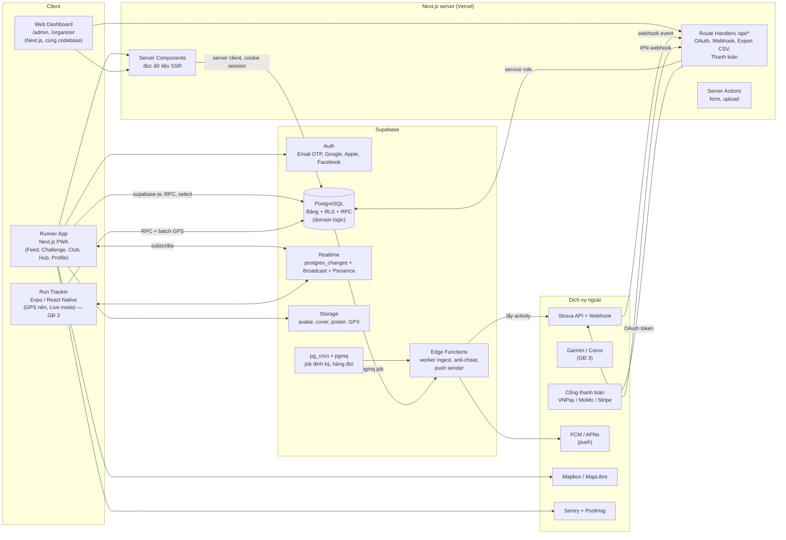
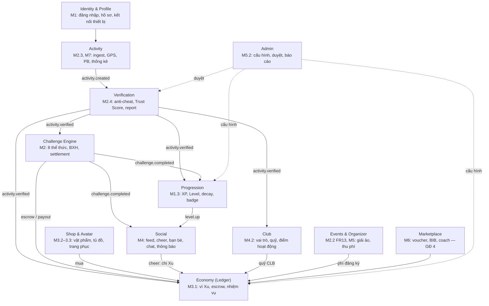
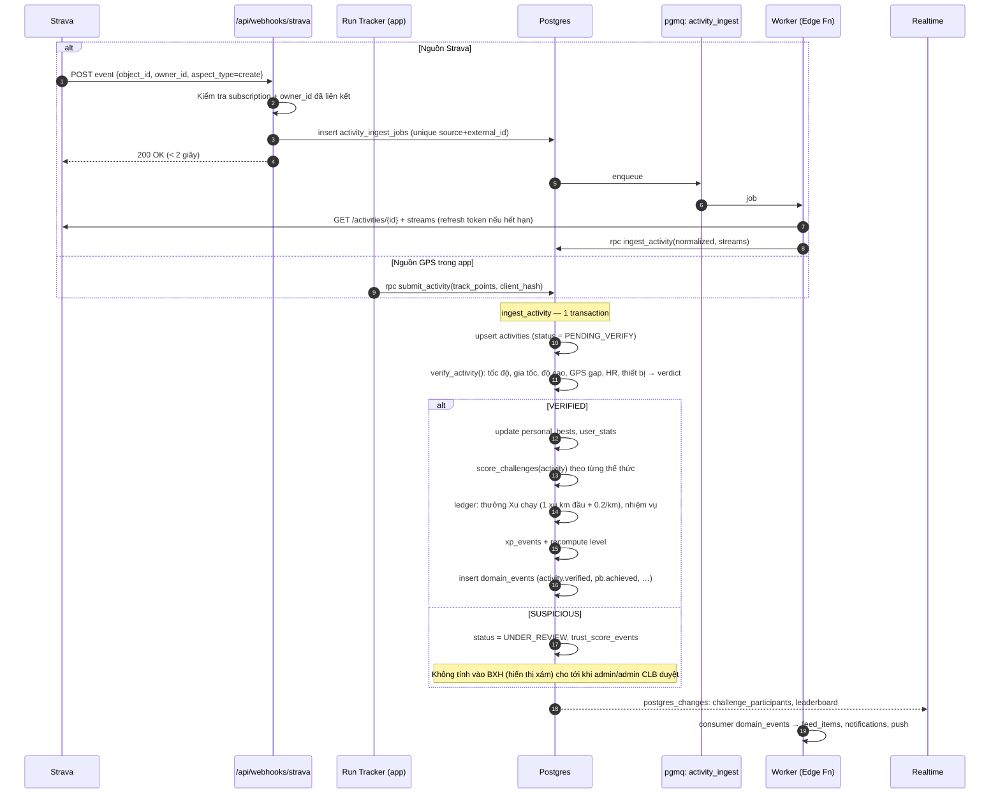
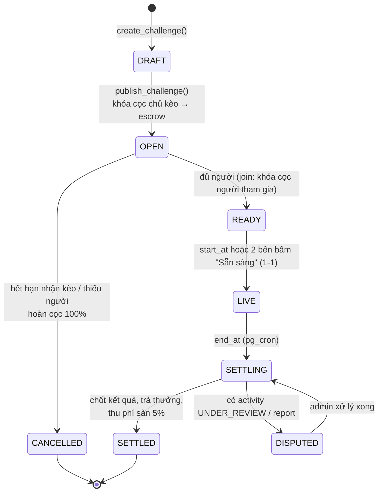
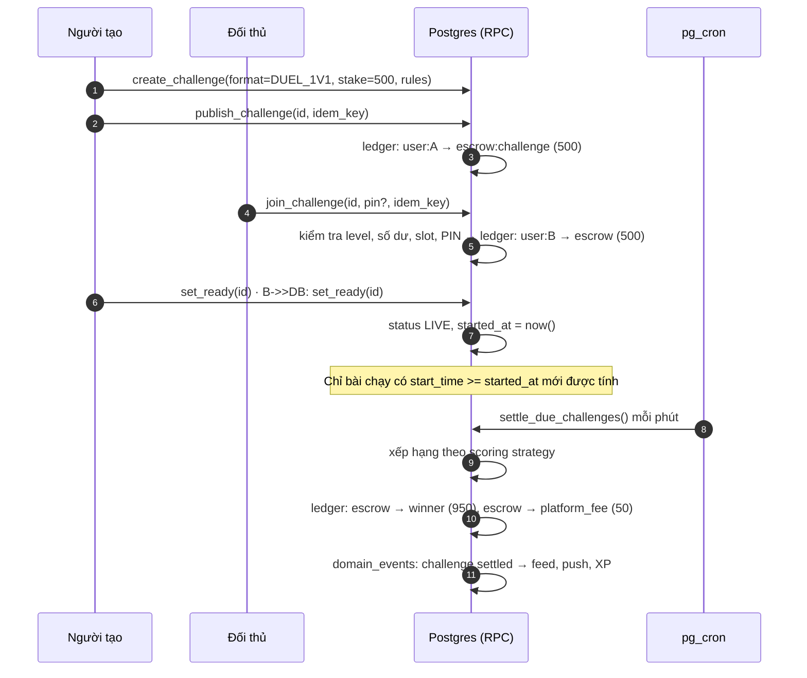
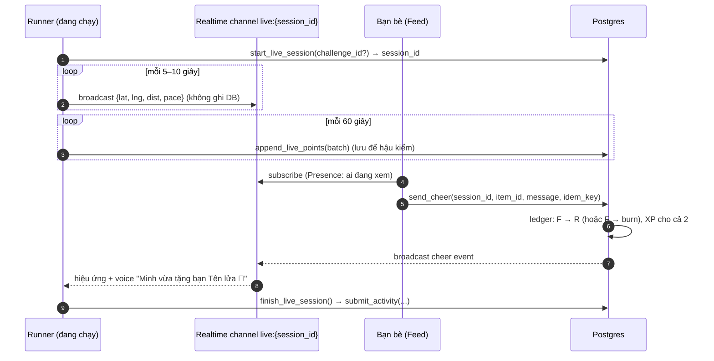
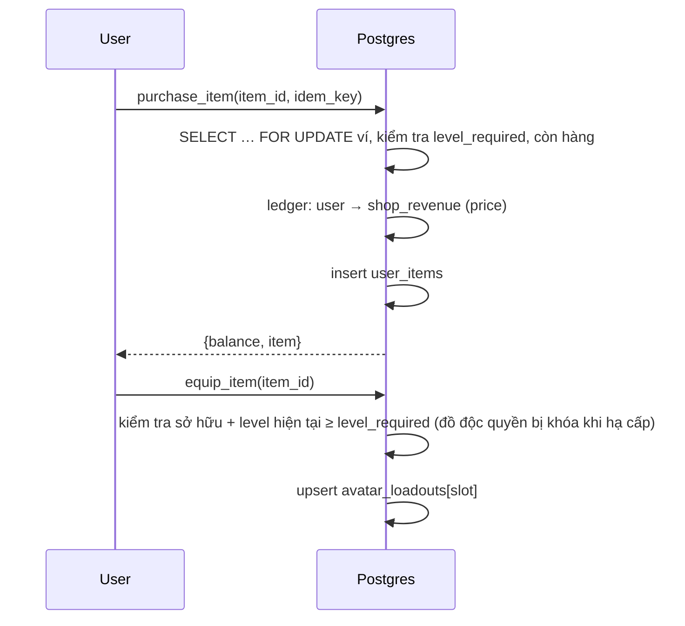

# RaceHub — Tài liệu Kiến trúc Phần mềm

> Phiên bản 1.0 · Nguồn yêu cầu: *Chi tiết module app*, *Chi tiết 28 màn hình RaceHub* · Áp dụng cho code tại nhánh `main` (Next.js 16 + Supabase).

| Tài liệu | Nội dung |
|---|---|
| [README.md](./README.md) (file này) | Đánh giá hiện trạng, sơ đồ thành phần, bounded context, luồng dữ liệu, lộ trình |
| [api.md](./api.md) | Thiết kế API: RPC command, REST route, Realtime channel, mã lỗi |
| [database.md](./database.md) | Lược đồ CSDL (ERD), nguyên tắc RLS, sổ cái kép, kế hoạch migrate |
| [schema.sql](./schema.sql) | DDL tham chiếu cho lược đồ đích (chưa phải migration, xem hướng dẫn trong file) |
| [frontend.md](./frontend.md) | Kiến trúc frontend, design system, cấu trúc thư mục, chuẩn UI |
| [adr/](./adr/) | Các quyết định kiến trúc quan trọng (ADR-001 … ADR-011) |

---

## 1. Đánh giá hiện trạng code

Phần đã làm tốt: tổ chức theo `features/*`, đã dùng RPC cho các nghiệp vụ nhạy cảm của CLB (`join_club`, `contribute_treasury`…), đã có ý tưởng sổ cái (`create_challenge_with_ledger`) và idempotency key.

Các vấn đề cần xử lý **trước khi** phát triển thêm tính năng (xếp theo mức độ nghiêm trọng):

| # | Vấn đề | Vị trí | Hệ quả | Hướng xử lý |
|---|---|---|---|---|
| 1 | Liên kết Strava dùng `state = user_id` thô, không ký, không kiểm tra phiên | `app/api/strava/callback/route.ts`, `ProfileTab.tsx` | Kẻ xấu gửi link OAuth với `state` = id nạn nhân → ghi đè token Strava và tên hiển thị của người khác | `state` = nonce ngẫu nhiên lưu server-side, gắn với phiên đăng nhập (ADR-006) |
| 2 | Route server fallback về `ANON_KEY` khi thiếu `SERVICE_ROLE_KEY`; token Strava lưu trong `profiles` | cùng file trên | Token OAuth có thể bị đọc qua API công khai nếu RLS của `profiles` cho phép select | Tách bảng `provider_connections` không có policy SELECT cho client; fail-fast khi thiếu key |
| 3 | Client tự `insert` profile với `xu: 500`, tự `update` bảng `profiles`, admin duyệt bài chạy bằng `update` trực tiếp | `app/page.tsx`, `ProfileTab.tsx`, `AdminDashboard.tsx` | Nếu RLS cho phép cập nhật cả dòng, user tự sửa được `xu`, `xp`, `level`, `role` | Tạo profile bằng trigger `on auth.users insert`; chỉ cho update cột an toàn; mọi thay đổi tài sản đi qua RPC (ADR-003) |
| 4 | RPC nhận `p_user_id` từ client (`submit_and_process_activity`, `equip_item`, `has_permission`, `create_challenge_with_ledger`) | `RunTab.tsx`, `characterApi.ts`, `club/api.ts`, `challengeApi.ts` | Nếu hàm SQL tin tham số này, người dùng mạo danh được người khác | Trong SQL luôn dùng `auth.uid()`, bỏ tham số `p_user_id` (ADR-003) |
| 5 | Chấm điểm thử thách chạy ở client (`racehubEngine.ts` gọi `update challenge_participants`) | `shared/lib/racehubEngine.ts` | Client tự tăng tiến độ, gian lận được | Chuyển toàn bộ engine xuống server (ADR-004) |
| 6 | Lược đồ không khớp nhau: `profile_id` vs `user_id`, `JOINED` vs `ACTIVE`, `strava_expires_at` vs `strava_token_expires_at`, `start_date` vs `activity_date`; `user_avatar` lặp `level/xp/coins` của `profiles` | nhiều file | Lỗi chạy ngầm, dữ liệu lệch | Một lược đồ chuẩn duy nhất ([database.md](./database.md)), sinh type bằng `supabase gen types` |
| 7 | Chỉ có 1 file migration; phần lớn bảng/RPC nằm trên Supabase Dashboard | `supabase/migrations` | Không tái tạo được môi trường, không review được | Kéo schema về bằng `supabase db pull`, từ nay mọi thay đổi DB đều là migration |
| 8 | Build lỗi: 11 lỗi TypeScript | xem bên dưới | Không deploy được | Sửa trong Giai đoạn 0 |
| 9 | Toàn bộ app là 1 trang, tab lưu bằng `useState`; không có route, không deep link, không SSR | `app/page.tsx` | Không chia sẻ link được, back button hỏng, chậm | App Router theo route (xem [frontend.md](./frontend.md)) |

Kết quả `npx tsc --noEmit` hiện tại:

```
app/layout.tsx                 Cannot find name 'LayoutProps'
features/*/…                   Cannot find module 'lucide-react'  (6 file — chưa có trong package.json)
features/character/CharacterHub.tsx  Property 'gender' does not exist …   (lỗi trong ảnh chụp màn hình)
features/club/index.ts         Cannot find module './components/ClubAdminPanel' / 'ClubDashboardWithLeaderboard'
```

Ngoài ra `CharacterHub.tsx` gọi `equipItemRpc(itemId, category)` trong khi hàm nhận `(userId, itemId)`, sai thứ tự tham số. Ở gốc repo còn một file rỗng tên `=` do gõ nhầm lệnh.

---

## 2. Kiến trúc tổng thể

**Kiểu kiến trúc:** *Modular monolith* trên nền **Supabase (PostgreSQL)** + **Next.js** làm Web App và BFF (Backend-for-Frontend). Không dùng microservices ở giai đoạn này (ADR-001).

### 2.1 Sơ đồ thành phần (Component Diagram)



### 2.2 Nguyên tắc phân tầng

| Tầng | Nơi chạy | Được phép | Không được phép |
|---|---|---|---|
| UI (component) | Browser | Hiển thị, gọi hook của feature | Gọi `supabase` trực tiếp |
| Feature API (`features/*/api`) | Browser / Server | Gọi RPC, `select` có RLS bảo vệ | `insert/update/delete` các bảng tài sản (ví, XP, tiến độ) |
| Route Handler / Server Action | Next.js server | Service role cho tích hợp ngoài | Chứa luật nghiệp vụ trùng với SQL |
| Domain logic | PostgreSQL (RPC `SECURITY DEFINER`) | Mọi thay đổi trạng thái có giá trị | Tin tham số `p_user_id` từ client |
| Worker | Edge Function + pgmq | Xử lý bất đồng bộ, gọi API ngoài | Chạy trong request của người dùng |

**Quy tắc vàng:** *Client chỉ đọc và phát lệnh (command). Server quyết định kết quả.* Xu, XP, tiến độ thử thách, Trust Score, cấp độ đều không có đường ghi trực tiếp từ client.

---

## 3. Bounded Context (Module nghiệp vụ)

Ánh xạ từ 8 module trong tài liệu sang các context trong code. Mỗi context sở hữu bảng của mình. Context khác chỉ đọc bảng đó qua view hoặc RPC, không ghi trực tiếp.



Mũi tên là **sự kiện miền (domain event)**. Sự kiện được ghi vào bảng `domain_events` (outbox) trong cùng transaction, rồi worker phát tán tới các context khác (ADR-005). Nhờ vậy khi thêm một phần thưởng mới cho bài chạy, ta chỉ thêm một consumer mà không phải sửa luồng ingest.

---

## 4. Luồng dữ liệu chính

### 4.1 Ghi nhận bài chạy (Strava webhook hoặc GPS trong app) → chấm điểm → thưởng

Đây là luồng quan trọng nhất của hệ thống. Mọi phần thưởng đều bắt nguồn từ nó.



Các điểm then chốt:
- **Idempotent:** khóa duy nhất `(source, external_id)` trên `activities`; ledger có `idempotency_key = 'activity:{id}:reward'`. Strava gửi trùng thì cũng không cộng thưởng hai lần.
- **Không làm việc nặng trong webhook:** Strava yêu cầu phản hồi trong 2 giây. Webhook chỉ ghi job rồi trả về.
- **Sửa hoặc xóa trên Strava** (`aspect_type=update/delete`): chạy bù trừ (reversal). Ghi bút toán đảo ngược, không sửa bút toán cũ.

### 4.2 Vòng đời thử thách có cược (1-1 / nhóm / đồng đội): Escrow & Settlement





Luật từ tài liệu được hiện thực hóa:
- Hòa: hoàn cọc cho cả hai, **trừ phí sàn**.
- Người gian lận bị xử thua ngay: bài chạy `REJECTED` khiến người đó bị loại (`DISQUALIFIED`), trừ Trust Score.
- Đội "quân số tự do": **mẫu số chốt tại `started_at`** (`team_size_locked`). Người chạy 0 km vẫn được tính vào mẫu số.
- Đội "quân số bằng nhau": đến giờ mà chưa đủ người thì `CANCELLED` và hoàn tiền.
- Thử thách bí mật: `get_challenge` trả `is_locked=true` và ẩn `description/rules` cho tới khi `unlock_challenge(id, pin)` thành công.

### 4.3 Live run, Cheer và bàn giao tiếp sức (Realtime)



**Tiếp sức (Relay):** khi Runner N gọi `finish_leg`, server xác nhận đủ cự ly, đặt `legs[N+1].unlocked_at = now()` rồi broadcast `relay:{team_id}` và gửi push "Đến lượt bạn!". Nút Start của Runner N+1 chỉ bật khi `unlocked_at IS NOT NULL`. Client không tự quyết định việc này. Job cron kiểm tra `unlocked_at + 30 phút` để phạt đội chậm bàn giao.

### 4.4 Mua vật phẩm / trang bị avatar



### 4.5 Job định kỳ (pg_cron)

| Job | Tần suất | Nghiệp vụ |
|---|---|---|
| `settle_due_challenges` | 1 phút | Chuyển LIVE→SETTLING→SETTLED, hoàn cọc kèo hết hạn |
| `relay_handover_watchdog` | 5 phút | Phạt đội bàn giao trễ quá 30 phút |
| `refresh_leaderboards` | 5 phút | Refresh materialized view BXH toàn cầu / khu vực |
| `reset_periodic_leaderboards` | 00:00 thứ Hai / ngày 1 | Chốt BXH tuần/tháng vào `leaderboard_snapshots`, thưởng Top 1 (500 XP) |
| `level_decay_warning` | hằng ngày | Gửi cảnh báo trước 7 ngày cho Lv 3–5 |
| `level_decay_check` | hằng ngày | Hạ cấp nếu không đủ hoạt động (5 buổi/30 ngày với Lv4–5; 3 buổi/60 ngày với Lv3) |
| `club_activity_score` | hằng ngày | Tính điểm hoạt động, decay; cảnh báo 4 tuần = 0; giải thể sau 2 tuần |
| `mission_rollover` | 00:00 hằng ngày / tuần | Sinh nhiệm vụ ngày/tuần mới |
| `strava_token_refresh` | 30 phút | Refresh token sắp hết hạn |

---

## 5. Yêu cầu phi chức năng → giải pháp

| Yêu cầu | Giải pháp |
|---|---|
| Onboarding ≤ 3 bước / 60 giây (NFR1) | Đăng nhập OAuth → Kết nối Strava (bỏ qua được) → Chọn nhân vật. Profile tạo tự động bằng trigger |
| BXH real-time | Bảng `challenge_participants` tăng dần + Realtime `postgres_changes` lọc theo `challenge_id`; BXH toàn cầu dùng materialized view |
| Toàn vẹn tài sản ảo | Sổ cái kép, `CHECK` số dư ≥ 0, `SELECT … FOR UPDATE`, idempotency key, không có UPDATE/DELETE trên `ledger_entries` |
| Chống gian lận | Pipeline verify phía server, Trust Score, report, duyệt thủ công (ADR-007) |
| Bảo mật | RLS trên mọi bảng, RPC dùng `auth.uid()`, secret chỉ ở server, OAuth state có nonce |
| Quan sát (observability) | Sentry (lỗi FE/BE), PostHog (funnel onboarding, retention), bảng `job_runs` cho cron |
| Quy mô | 10k–100k user chạy tốt trên 1 Postgres (Supabase Pro). Partition `activity_points` theo tháng; khi cần, tách read replica cho BXH |

---

## 6. Lộ trình triển khai đề xuất

| Giai đoạn | Mục tiêu | Hạng mục |
|---|---|---|
| **0. Ổn định** (1–2 tuần) | Build xanh, an toàn | Sửa 11 lỗi TS; `supabase db pull` đưa schema vào migrations; sửa OAuth state; chặn client ghi `profiles.xu/xp/role`; bỏ `p_user_id`; xóa `racehubEngine.ts` phía client; thêm CI (lint + typecheck + build) |
| **1. Nền tảng** (3–4 tuần) | Kiến trúc đích | Ledger kép; pipeline ingest Strava webhook; App Router theo route; design system; sinh type từ DB |
| **2. Core loop** (4–6 tuần) | MVP có thể ra mắt | Thử thách: Volume, Distance, Streak, Pace Breaker, 1-1 có cược, Đồng đội SUM/AVG; Feed tự động; Cheer; Shop + Avatar; XP/Level; BXH |
| **3. Mở rộng** | Giữ chân user | App native (Expo) chạy GPS nền + Live mode; Relay, Hunter, Bí mật; Chat; Club treasury/score; level decay; Garmin/Coros |
| **4. Doanh thu** | Kiếm tiền | Web Dashboard BTC + thanh toán; Marketplace voucher; BIB resell; Coach directory; Training plan Premium |

Chi tiết các quyết định kiến trúc: [adr/](./adr/).
