# Lược đồ Cơ sở dữ liệu

DDL đầy đủ: [schema.sql](./schema.sql). File đã được kiểm tra chạy được trên PostgreSQL 16 (Supabase dùng PG 15+).

## 1. ERD tổng quan

```mermaid
erDiagram
  profiles ||--|| profile_settings : has
  profiles ||--|| user_stats : has
  profiles ||--o{ user_roles : has
  profiles ||--o{ provider_connections : "private"
  profiles ||--o{ friendships : "user_low/high"

  profiles ||--o{ activities : records
  activities ||--o| activity_streams : "GPS/HR"
  activities ||--o{ activity_splits : "per km"
  activities ||--o{ activity_reports : flagged
  activities ||--o{ activity_reviews : reviewed
  profiles ||--o{ personal_bests : holds
  profiles ||--o{ trust_score_events : "trust log"

  profiles ||--o{ ledger_accounts : "WALLET"
  clubs ||--o{ ledger_accounts : "TREASURY/DEPOSIT"
  challenges ||--o| ledger_accounts : "ESCROW"
  ledger_transactions ||--|{ ledger_entries : "sum = 0"
  ledger_accounts ||--o{ ledger_entries : posts

  profiles ||--o{ xp_events : earns
  profiles ||--o{ user_badges : wins
  badges ||--o{ user_badges : ""
  profiles ||--o{ user_missions : progresses
  missions ||--o{ user_missions : ""

  items ||--o{ user_items : owned
  profiles ||--o{ user_items : "tủ đồ"
  profiles ||--|| avatar_profiles : looks
  user_items ||--o{ avatar_loadouts : "equipped in slot"

  clubs ||--o{ club_members : has
  profiles ||--o{ club_members : joins
  clubs ||--o{ club_announcements : posts
  clubs ||--o{ club_score_events : scores

  challenges ||--o{ challenge_teams : has
  challenges ||--o{ challenge_participants : has
  challenge_teams ||--o{ challenge_participants : groups
  challenge_teams ||--o{ relay_legs : "relay order"
  challenges ||--o{ challenge_contributions : counts
  activities ||--o{ challenge_contributions : "counted in"
  challenges ||--o{ challenge_invites : invites
  clubs ||--o{ challenges : "scope CLUB"

  profiles ||--o{ live_sessions : runs
  profiles ||--o{ feed_items : acts
  feed_items ||--o{ reactions : liked
  feed_items ||--o{ comments : ""
  feed_items ||--o{ cheers : ""
  live_sessions ||--o{ cheers : "live cheer"
  items ||--o{ cheers : "cheer item"
  profiles ||--o{ notifications : receives
  conversations ||--o{ conversation_members : ""
  conversations ||--o{ messages : ""

  organizers ||--o{ events : hosts
  events ||--|| challenges : "scored by"
  events ||--o{ event_registrations : ""
  payments ||--o| event_registrations : pays
```



## 2. Nhóm bảng theo module

| Module (tài liệu) | Bảng | Ghi chú thiết kế |
|---|---|---|
| M1 Người dùng & Hồ sơ | `profiles`, `profile_settings`, `user_roles`, `private.provider_connections`, `private.oauth_states`, `push_tokens`, `user_stats`, `personal_bests` | Token OAuth nằm ở schema `private`, API công khai không đọc được. `user_stats` và `personal_bests` là dữ liệu dẫn xuất do engine cập nhật (FR5) |
| M1.3 Level & XP | `level_definitions`, `xp_events`, `level_checks`, `badges`, `user_badges` | `profiles.xp` là **cache** của `sum(xp_events)`. Luật decay lưu dạng JSON trong `level_definitions`, admin sửa được mà không cần deploy |
| M2 Thử thách | `challenges`, `challenge_teams`, `challenge_participants`, `challenge_contributions`, `relay_legs`, `challenge_invites` | Một bảng `challenges` phục vụ cả 8 thể thức: `format` × `objective` + `rules jsonb`. `challenge_contributions` cho biết bài chạy nào đã được tính, để đảo ngược khi bài bị loại |
| M2.4 Chống gian lận | `activities.status/verify_flags`, `activity_reports`, `activity_reviews`, `trust_score_events` | `trust_score` là cache của `sum(trust_score_events)`, giới hạn trong 0..100 |
| M3 Kinh tế ảo | `ledger_accounts`, `ledger_transactions`, `ledger_entries`, `missions`, `user_missions`, `config_versions`, `payments` | Sổ cái kép (ADR-002). **Không có cột `profiles.xu`**. Số dư đọc từ `ledger_accounts.balance` |
| M3.2 Shop & Avatar | `items`, `user_items`, `avatar_profiles`, `avatar_loadouts` | `avatar_loadouts` mỗi slot là một dòng, thay cho bảng 10 cột `user_equipment`. Thêm slot mới không phải sửa schema |
| M4 Xã hội | `friendships`, `feed_items`, `reactions`, `comments`, `cheers`, `live_sessions`, `notifications`, `conversations`, `conversation_members`, `messages` | Feed dạng *fan-out on read* (ADR-008). Bộ đếm `like_count`, `cheer_count` được cache trên `feed_items` |
| M4.2 Club | `clubs`, `club_members`, `club_role_permissions`, `club_announcements`, `club_score_events`, `club_reports` | Quỹ CLB và tiền ký quỹ là `ledger_accounts` (owner_type=`CLUB`). Mọi giao dịch quỹ đều minh bạch trong ledger, nên không cần bảng `club_transactions` riêng |
| M4.4 BXH | `lb_*` (materialized view), `leaderboard_snapshots` | BXH hiện tại là view refresh 5 phút. BXH kỳ đã chốt là snapshot bất biến |
| M5–M6 BTC, Marketplace | `organizers`, `events`, `event_registrations`, `partners`, `vouchers`, `voucher_redemptions` | Giải ảo của BTC dùng lại Challenge Engine qua `events.challenge_id` |
| Hạ tầng | `domain_events`, `activity_ingest_jobs`, `private.audit_log` | Outbox pattern (ADR-005) |

## 3. Mô hình thử thách: `format` × `objective` × `rules`

Tài liệu mô tả khoảng 15 biến thể thử thách. Nếu mỗi biến thể có một bảng riêng, schema sẽ phình ra rất nhanh. Thay vào đó, mỗi thử thách được mô tả bằng ba trục độc lập:

| Trục | Ý nghĩa | Giá trị |
|---|---|---|
| `format` | Ai đấu với ai, tổ chức ra sao | `SOLO_GOAL`, `DUEL`, `GROUP`, `TEAM_VS`, `RELAY`, `COMMUNITY`, `SECRET`, `HUNTER`, `EVENT` |
| `objective` | Một bài chạy đóng góp gì vào điểm | `VOLUME`, `DISTANCE`, `PERFORMANCE`, `PACE`, `NEGATIVE_SPLIT`, `STREAK`, `SESSIONS`, `TIME`, `AVG_PACE` |
| `rules` (jsonb) | Tham số chi tiết | xem ví dụ bên dưới |

Ví dụ ánh xạ từ tài liệu:

| Màn hình / mục tài liệu | format | objective | rules |
|---|---|---|---|
| 2.1 Pace Breaker | `SOLO_GOAL` | `PACE` | `{"target_pace_s":300,"min_distance_m":5000,"min_avg_hr":120}` |
| 2.1 Volume Goal "100km tháng 1" | `SOLO_GOAL` | `VOLUME` | `{"target_m":100000,"penalty_xu":50}` |
| 2.1 Negative Split | `SOLO_GOAL` | `NEGATIVE_SPLIT` | `{"distance_m":10000,"min_gap_s":5}` |
| 2.2 1-1 "Ai nhanh hơn" | `DUEL` | `AVG_PACE` | `{"window_minutes":60,"accept_within_h":2,"min_distance_m":5000}` + `funding=ENTRY_STAKE, stake_xu=500, require_ready=true` |
| 2.3 Đối kháng đồng đội, quân số tự do | `TEAM_VS` | `VOLUME` | `{"team_scoring":"AVG","min_member_m":1000,"pace_range_s":[240,900],"team_count":2,"team_size":{"min":2,"max":50},"assignment":"SELF_PICK"}` |
| 2.3 Đối kháng đồng đội, quân số bằng nhau | `TEAM_VS` | `VOLUME` | `{"team_scoring":"SUM","team_size":{"exact":5}}` |
| 2.4 Tiếp sức | `RELAY` | `TIME` | `{"legs":4,"leg_m":10000,"handover":"HARD","soft_pct":90,"max_handover_wait_min":30,"max_handover_gap_m":1000}` |
| 2.5 Tập thể / cộng đồng | `COMMUNITY` | `VOLUME` | `{"collective_target_m":10000000}` |
| 2.6 Bí mật | `SECRET` | `DISTANCE` | `{"target_m":21100,"tolerance_m":100}` + `pin_hash` |
| 2.7 Săn mồi | `HUNTER` | `PACE` | `{"prey_id":"…","prey_target_m":10000,"win_condition":"FASTER_PACE","daily_window":["04:00","08:00"],"tz":"Asia/Ho_Chi_Minh"}` + `min_level` |
| FR13 Giải ảo BTC | `EVENT` | `DISTANCE` | `{"distances_m":[5000,10000,21100],"cutoff_s":{"21100":12600}}` |

`rules` được validate ở **hai lớp**:
1. Client dùng Zod schema cho từng cặp (format, objective) để báo lỗi ngay trên form wizard.
2. Server kiểm tra lại bằng hàm `validate_challenge_rules(format, objective, rules)` trong `create_challenge`. Luôn phải có lớp server vì client có thể bị sửa.

Engine tính điểm viết theo **Strategy pattern**. Mỗi `objective` có hàm `score_<objective>(participant, activity)` trả về `contribution`. Mỗi `format` có hàm `rank_<format>(challenge)` và `settle_<format>(challenge)`. Thêm thể thức mới chỉ cần thêm hàm, không phải sửa hàm cũ.

## 4. Sổ cái kép (Double-entry ledger)

```
Ví dụ: A và B cược 1-1, mỗi người 500 Xu, phí sàn 5%, A thắng

tx STAKE(A)   : wallet:A  -500 | escrow:C +500
tx STAKE(B)   : wallet:B  -500 | escrow:C +500
tx PAYOUT     : escrow:C -1000 | wallet:A +950 | system:PLATFORM_FEE +50
Kiểm tra: mỗi transaction tổng = 0; escrow:C kết thúc = 0.
```

Các bất biến (invariant) mà database tự đảm bảo:
- Mỗi `ledger_transactions` có tổng `amount` bằng 0 (`LEDGER_UNBALANCED`).
- Số dư không âm, trừ `SYSTEM:MINT` (`INSUFFICIENT_BALANCE`).
- Không có UPDATE hoặc DELETE trên bút toán (`LEDGER_IMMUTABLE`). Muốn sửa sai thì ghi transaction `REVERSAL`.
- `idempotency_key` là duy nhất. Gọi lại một command sẽ trả về kết quả cũ.
- Một job đối soát hằng ngày kiểm tra `ledger_accounts.balance = sum(ledger_entries.amount)` cho mọi tài khoản và kiểm tra `sum(tất cả balance) = 0`.

Idempotency key chuẩn:

| Nghiệp vụ | Key |
|---|---|
| Thưởng chạy | `activity:{activity_id}:run_reward` |
| Nhiệm vụ | `mission:{mission_id}:{user_id}:{period_start}` |
| Cọc thử thách | `stake:{challenge_id}:{user_id}` |
| Trả thưởng | `payout:{challenge_id}:{participant_id}` |
| Cheer / mua hàng | UUID do client sinh khi mở form (chống double-tap) |

## 5. Bảo mật dữ liệu (RLS)

| Loại bảng | SELECT | INSERT/UPDATE/DELETE từ client |
|---|---|---|
| Hồ sơ công khai (`profiles`) | Tất cả | Chỉ UPDATE các cột an toàn (dùng column-level `GRANT`) |
| Dữ liệu cá nhân (`profile_settings`, `notifications`, `user_missions`) | Chủ sở hữu | Chủ sở hữu, chỉ các cột an toàn |
| Tài sản (`ledger_*`, `xp_events`, `user_items`, `challenge_participants.progress`) | Chủ sở hữu / công khai tùy bảng | **Không**. Chỉ qua RPC |
| Nội dung (`activities`, `feed_items`) | Theo `visibility` + quan hệ bạn bè / CLB | Không (activity qua RPC). Comment/reaction được insert với `user_id = auth.uid()` |
| Bí mật (`private.*`) | Không | Không. Chỉ service role / hàm definer |

Mọi hàm `SECURITY DEFINER` phải:
1. `set search_path = ''` và dùng tên đầy đủ `public.table`.
2. Lấy người gọi từ `auth.uid()`. **Không nhận `p_user_id`**.
3. Khóa dòng cần thiết (`FOR UPDATE`) theo thứ tự cố định.
4. Ném lỗi bằng mã ổn định (`CHALLENGE_FULL`, `INSUFFICIENT_BALANCE`…) để client dịch ra thông báo (xem [api.md §5](./api.md#5-mã-lỗi)).
5. `revoke execute … from anon` nếu hàm không dành cho khách.

## 6. Hiệu năng & quy mô

- Index theo đúng truy vấn nóng: feed (`actor_id, created_at desc`), BXH thử thách (`challenge_id, score desc`), bài chạy chờ duyệt (partial index).
- `activity_streams` tách khỏi `activities` để bảng chính gọn. Khi vượt khoảng 50 triệu điểm GPS, chuyển sang file nén trên Storage và chỉ lưu `raw_hash` + đường dẫn.
- Bộ đếm (`member_count`, `like_count`, `cheer_count`) được cache bằng trigger. Không dùng `count(*)` khi hiển thị danh sách.
- BXH toàn cầu dùng materialized view refresh `concurrently`. BXH thử thách đọc trực tiếp (vì đã có index) và nhận cập nhật qua Realtime.
- Trần quy mô ước tính: khoảng 100k DAU trên Supabase Pro/Team trước khi cần read replica.

## 7. Kế hoạch migrate từ schema hiện tại

Schema hiện tại chỉ được suy ra từ code (chỉ có 1 file migration). Bước đầu tiên bắt buộc là `supabase db pull`.

| Hiện tại (suy ra từ code) | Đích | Cách migrate |
|---|---|---|
| `profiles.xu` | `ledger_accounts` (WALLET) | Tạo ví cho mọi user; transaction `OPENING_BALANCE` từ MINT bằng đúng số `xu` hiện có; sau đó bỏ quyền ghi rồi xóa cột |
| `profiles.role` (text) | `user_roles` | Copy các dòng `SYSTEM_ADMIN`; `CLUB_ADMIN` chuyển thành vai trò trong `club_members` |
| `profiles.strava_*` | `private.provider_connections` | Copy rồi xóa cột; refresh lại token |
| `clubs.treasury_balance` | `ledger_accounts` (CLUB/TREASURY) | Giống `xu` |
| `user_avatar` (có `level/xp/coins`) | `avatar_profiles` | Giữ `gender/skin/hair`, bỏ các cột trùng |
| `user_equipment` (10 cột `*_item_id`) | `avatar_loadouts` | Unpivot mỗi cột thành 1 dòng |
| `user_inventory` | `user_items` | Đổi tên, thêm `acquired_via` |
| `activities.user_id` / `profile_id`, `start_date` / `activity_date` | `activities.user_id`, `start_time` | Chuẩn hóa về một tên, cập nhật code |
| `activity_history` (log kết nối Strava) | `private.audit_log` | Không phải dữ liệu bài chạy, nên chuyển sang audit |
| `challenges.challenge_type` + `game_mode` | `format` + `objective` + `rules` | `INDIVIDUAL+ACCUMULATE` → `GROUP/VOLUME`; `TEAM+TEAM_SUM` → `TEAM_VS/VOLUME {team_scoring:SUM}`… |
| `challenge_participants.status` `ACTIVE/JOINED` | `JOINED` | Thống nhất một giá trị |
| `system_config_versions` | `config_versions` | Giữ dữ liệu, thêm cột `status` |

Quy trình cho mỗi bước: viết migration → chạy trên project Supabase **staging** → chạy script đối soát (số dư trước/sau) → áp lên production.
